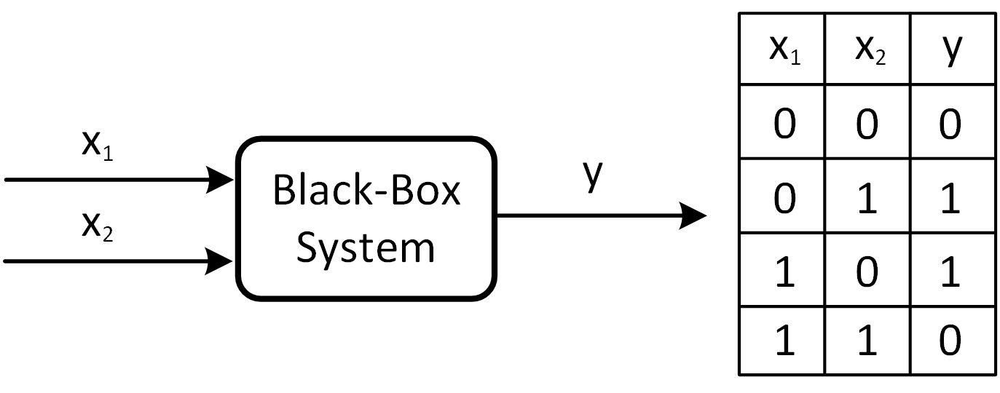
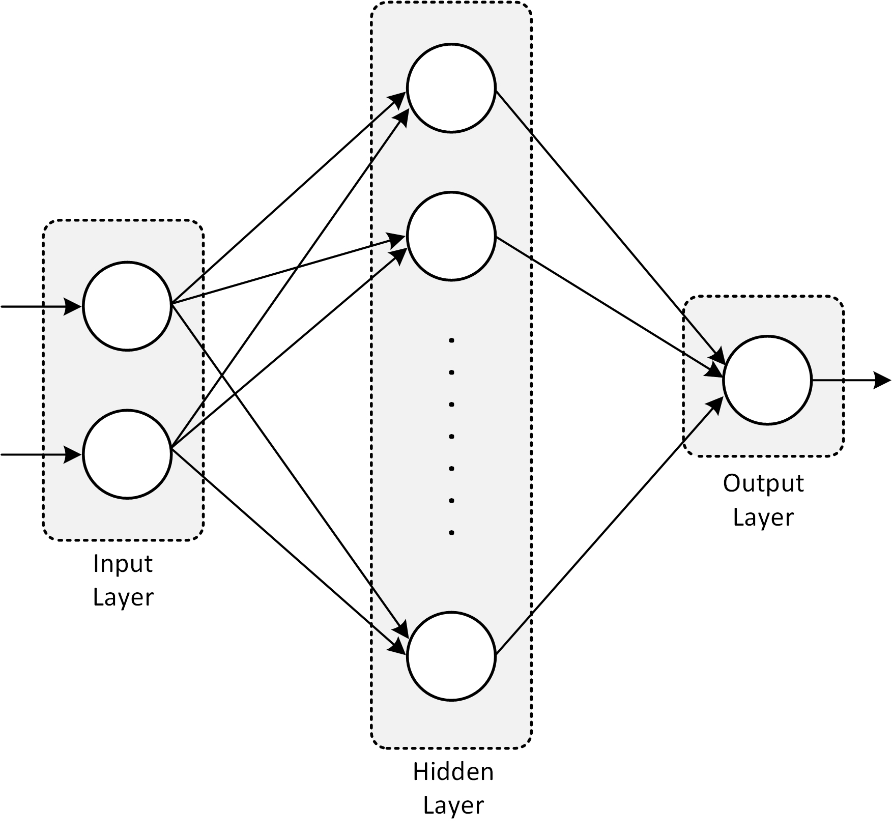

# EESEC 440 English for EEE on DL
## I. Artificial Neural Networks
Artificial neural networks (ANN) are extremely powerful structures that are capable of relating input-output data with utmost complexity. The increment in computational power provided by the new generation Graphical Processing Units (GPU) in the last decade enabled ANN to solve many engineering problems in various fields of study (e.g., Computer Vision, speech recognition, Natural Language Processing, power transfer [1], etc). There are different flavors of ANN designed for different applications depending on the needs. Multi-layer Perceptron (MLP) is one of the most preferred type of network commonly employed in regression and classification problems, which are two major functions of a ANN.
### A. Multi-layer Perceptron (MLP)
We will study MLP elaborately throughout the course. Regression and classification examples, both supervised learning. Please see *Fig. 1* for an example MLP network structure.

*Fig. 1:* A multi input single output MLP. 

#### Exclusive OR (XOR) Problem

*Fig. 2:* A MLP network is going to learn XOR problem.

*Fig. 3:* For the XOR problem, we use a MLP with one hidden layer consisting of sixteen neurons.

*Fig. 4:* Error back-propogation algorithm (e.g., Gradient Descent) is used to update the network parameters.
#### Çok Katmanlı bir Yapay Sinir Ağının Ayarlabilen Parametre (Ağırlık) Sayısı

*Fig. 5:* A MLP network with one input, three neurons in the hidden layer and single output. This network has 2 : 3 : 1 configuration.

Yukarıda *Fig. 5*'de gösterilen yapay sinir ağının konfigurasyonu 2 : 3 : 1 olup, giriş katmanında iki, gizli katmanında üç ve çıkış katmanında bir nöron bulundurmaktadır (yuvarlaklar nöronları temsil ediyor). Şekilde ayarlanabilen parametre sayısı 13 olarak gözüküyor: w1, w2, w3, w4, w5, w6, w7, w8, w9, w10, w11, w12, w13. Ara sınavda karşımıza çıkabilecek benzer bir yapıda, verilen konfigürasyona göre ayarlanabilen parametre (ağırlık) sayısını hem elimizle çizerek, hem de formülize ederek kısa yoldan hesaplayabiliriz. Formülü siz de biraz düşünürseniz kendiniz çıkarabilirsiniz. Giriş, çıkış ve bir gizli katmandan oluşan bir yapay sinir ağındaki toplam ayarlanabilen parametre (ağırlık - weight) sayısını bulan formül şöyle:

n = (n1 x n2 + n2) + (n2 x n3 + n3)

Burada n1 giriş katmanındaki nöron sayısı, n2 gizli katmandaki nöron sayısı ve n3 çıkış katmanındaki nöron sayısı olurken n ise toplam ayarlanabilen parametre yani ağırlık (weight - w) sayısı. Yukardaki formülde uygun terimler ortak parantez alınırsa, formül aşağıdaki halini alır:

n = n2(n1 + 1) + n3(n2 + 1)

*Fig. 5*'de verilen 2 : 3 : 1 konfigürasyonlu ağı formülde test edecek olursak n = 3(2 + 1) + 1(3 + 1) = 3 x 3 + 1 x 4 = 13 değerini onaylamış oluruz.

**Not:** Ara sınavdaki en zor soru **Çok Katmanlı bir Yapay Sinir Ağının Ayarlabilen Parametre (Ağırlık) Sayısı** sorusu denebilir. Ancak soru içinde bütün açıklamalar mevcut. Ayrıca sınav 2 saat, toplam soru sayısı 11 (bütün sorular çoktan seçmeli yani sınav test) dolayısıyla yeterli vakit var. İçinizden bazıları bu tarz bir hesaplamayı derste açıkça görmediğimizden yakınabilir. Çok basit bir soru olmasına rağmen puan kaybı yaşayanlar **github** hesabı oluşturup derste yaptığımız birkaç örneği hesaplarına iterek telafi ettikleri puanları kazanabilirler kolaylıkla. Size örnek olsun diye buraya bir alıştırma sonucunu yazayım: 2 : 4 : 2 konfigürasyonundaki bir çok katmanlı yapay sinir ağında toplam 

n = 4(2 + 1) + 2(4 + 1) = 22 

ayarlanabilen ağırlık vardır. Ben sizin yerinizde olsam formülü anlamasam bile (ki oldukça basit bir formül) verilen konfigürasyondaki çok katmanlı yapay sinir ağını elimle çizer ve ayarlanabilen ağırlıkları tek tek sayarım. Sınavda, *Fig. 5*'de gördüğümüz zorluk seviyesinde bir soru karşımıza çıkacak.

Final sınavında ise burada *Fig. 5*'deki gibi iki katmanlı (giriş katmanı sayılmadığından iki katman deniyor, yoksa üç katmanlı) değil birden fazla gizli katmana sahip bir yapay sinir ağında ne kadar ayarlanabilen parametre (ağırlık) olduğunu soracağım. Dikkatlice düşünecek olursak, yukarıda iki katmanlı (giriş katmanı sayılmadığından iki katman deniyor, yoksa üç katmanlı) bir ağ yapısı için türettiğimiz formülü k-1 katmanlı bir MLP için aşağıdaki gibi genelleştirebiliriz.

#### 2 Boyutlu Sınıflandırma Problemi

*Fig. 6:* Derste işlediğimiz 2 boyutlu sınıflandırma probleminde en başta karşılaştığımız bazı adımlar.

#### En Küçük Kareler (Least Squares)

*Fig. 7:* Derste işlediğimiz bir boyutlu optimizasyon (veya regresyon) probleminin görselleştirilmiş hali.

### B. Convolutional Neural Network (CNN)
We might study classification example on images in the last weeks of the course. Cats-dogs image repository on Kaggle. We will follow the tutorial given in [2]. Please see Figures 8 and 9 for classification of cat and dog images via CNN. 

*Fig. 8: Classification of cat & dog images via CNN.*

*Fig. 9: Cats and dogs classification with deep learning.*

## References
[1] T. Guillod, P. Papamanolis and J. W. Kolar, "Artificial Neural Network (ANN) Based Fast and Accurate Inductor Modeling and Design," in IEEE Open Journal of Power Electronics, vol. 1, pp. 284-299, 2020, doi: 10.1109/OJPEL.2020.3012777. 
[2] "How to classify photos of dogs and cats (with 97% accuracy)." https://machinelearningmastery.com/how-to-develop-a-convolutional-neural-network-to-classify-photos-of-dogs-and-cats/. Accessed: 2021-3-10. 
